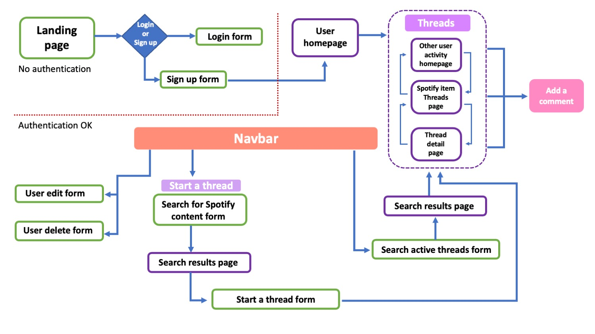

# Spotify Comments Web App

Visit the site [here](http://spotify-comments-web-app.herokuapp.com/)

## General description

A site that communicates with [Spotify's API](https://developer.spotify.com/documentation/web-api), and allows users to search from Spotify's catalog and create [threads](#threads) about [Spotify's content](#spotify-content). These threads can also have comments from other users in order to start a discussion about music content.

## Implemented features

1. Authentication process: form validation and data encryption with the use of WTForms and bcrypt.

2. Personal user profile creation page: user info can be edited or deleted, users can check other user's activity in the platform. 

2. Communication with an External API: Information is obtained from Spotify's catalog, the authentication process is done automatically, tokens are renewed if they are required so. Images and relevant information is displayed on the site based on the type of item that is requested.  via API communication, but also from the site's own database.

3. Caching of information: Spotify's information is cached once a thread is done. Nested information is also saved accordingly.For example in the case of a track, the site will cache the artist/s that made track, and the album to which the track belongs in its respective tables.

2. Interconnected database models: Multiple information can be retrieved from a single query. By selecting a user, all the threads and comment that the user has made can be accessed. If a Spotify Item is selected, all the different threads from different users can be accesesed, database schema design can be found in [here](docs/Schema_design_Spotify_Comments.pdf).

## User flow

Here's a diagram of the user flow on the site. 

### User registration and first steps

The page requires the user to register and create a profile. The user homepage is the place where the user is taken after loging in, in this page all there's a display of all the threads that exist in the database. From here the user can access to various elements from each thread. By cliking on the user that created the thread, the app will show all that user's activity on the page called other user's activity homepage in the diagram. 

### Navigation through threads users and Spotify content

By clicking in the thread keyword, the user can see a detail page about that specific thread and from there it can add comments to the thread. By clicking on the Spotify item it will display all the threads that have been created on that Spotify item. From each of this pages the user can go back and forth those topics. 

### Navbar options 

The navbar options big part of the page functionality. The user can be able to return to its homepage by cliking on the app icon or in the user profile item in the menu. Also in this menu the user can modify and eliminate its profile via de efit and delete user forms. In the nav bar the search seciton will search for keywords that match the Spotify item content and will display the search results in a page. The user is also able to add a new thread form the navbar menu. 

### Creating a Thread

The first step in this process is to find the item from Spotify's catalog. The user can search for three types if items: Artists, Albums and Tracks, the result page will be diplayed after making the query to Spotify's API. From there the results wil be displayed in the search results page, the user can select which item to start a thread on by clicking on the button, a form to start a thread is displayed and the user can type the thread title and additional comments, after submitting this, the user is taken to a detail about the thread which also sends the option to look for more threads about the same Spotify content.

### Spotify Content

The web page extracts informtation form the API. The authentication process is done server-to-server through the [Client Credentials Flow](https://developer.spotify.com/documentation/web-api/tutorials/client-credentials-flow), form Spotify's API. The page extracts data such as Spotify ID's, artist names, song and album titles, url images, release dates and amount of tracks.

## Caching of information

The JSON information is passed directly from the API and rendered in the page. Only until a user starts a thread about the Spotify item. The app will cache the Spotify item, depending if it's a Artist, Album or Track. In the case of Albums or Tracks, this items will need also the caching of more elements in the database. For example if the Artist that made the Album is not found in the database, the app will also cached the Artist. The same will happen if while caching a Track, the Artist or Album asociated with the Track are not found in the database the app will search and cache them as well. 

## Threads

Threads are the main element upon the page works around, it consists of a title and a description, once a thread is done, users can add comments to the thread in order to start a discussion. A thread is linked to a cached Spotify content, and each thread belongs to a single user. Spotify items can have multiple threads and each thread can only be associated to a single Spotify content.

## Technical information

The app uses flask as the main web framework in which all the routes are stablished. The forms are created using WTForms, the authentication process is handed by individual handlers. The database models and the queries are made using SQL Alchemy, and all the templates used to build the app front end are done using jinja2 to create dynamic elements based upon the type of object or kind of item that is sent. The style of the HTML is done mainly with bootstrap with the help of CSS and also in several occasions the page uses JavaScript and AXIOS to add comment forms, send requests and create comment instances in the threads.

### User keys in session

The process to use the page is to regiter of log in, the user id is stored in the session as SPOTIFY_COMMENTS_USER_KEY and also the user object is stored and pass as the g (global object) in flask.

### Site address: **<https://spotify-comments-web-app.herokuapp.com>**